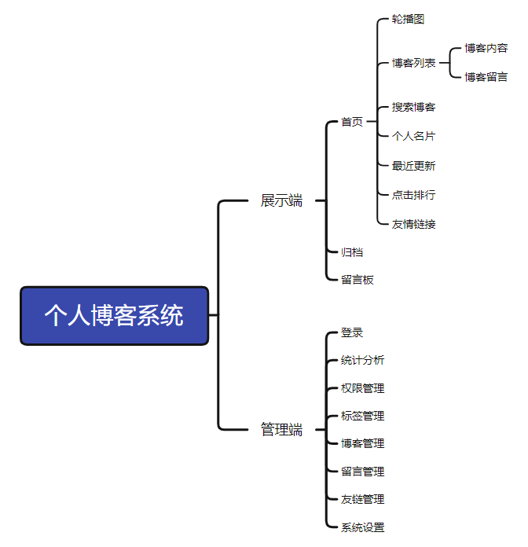
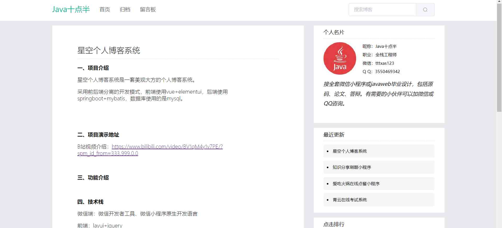
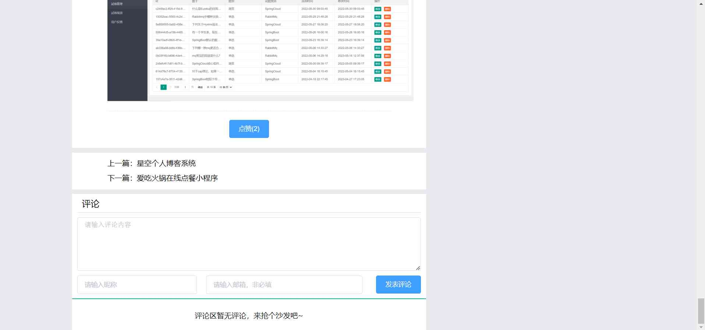
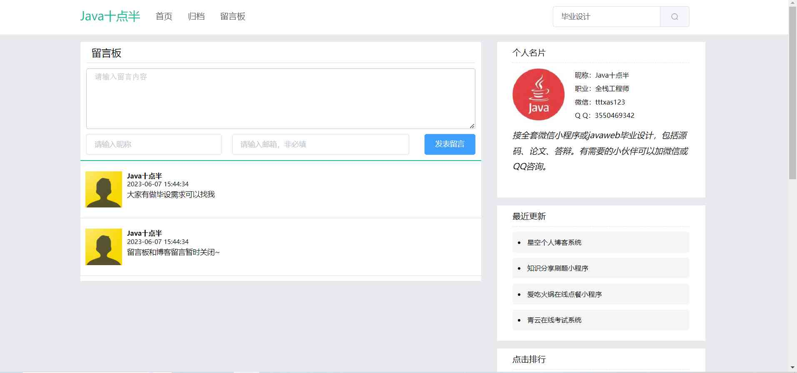
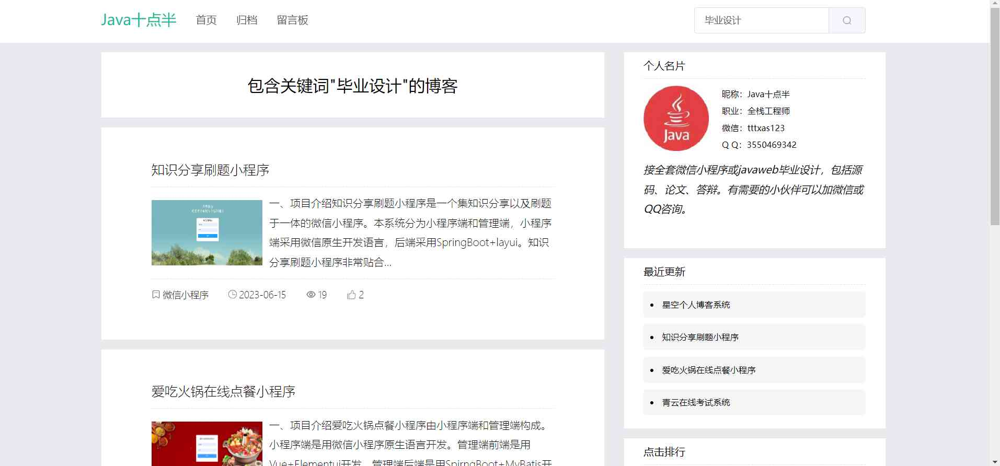
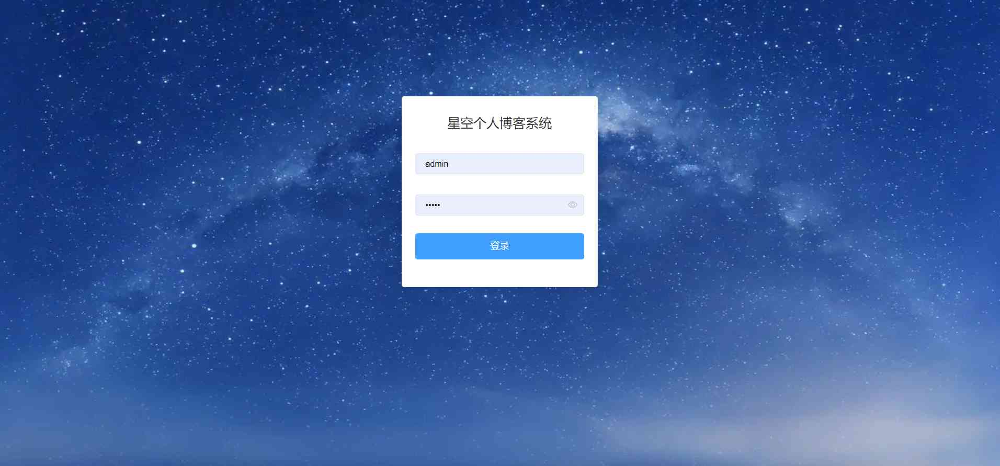
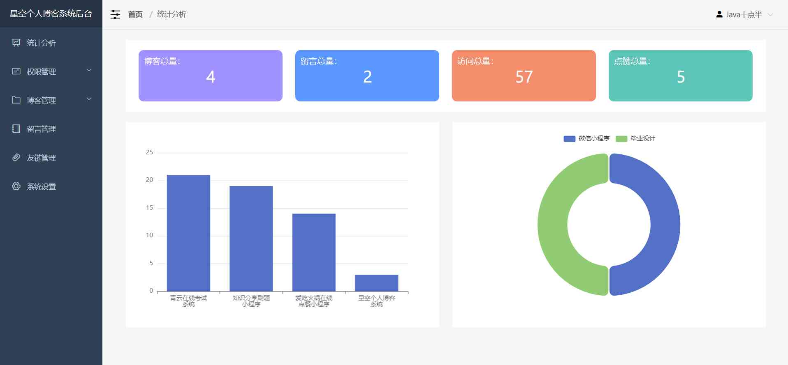
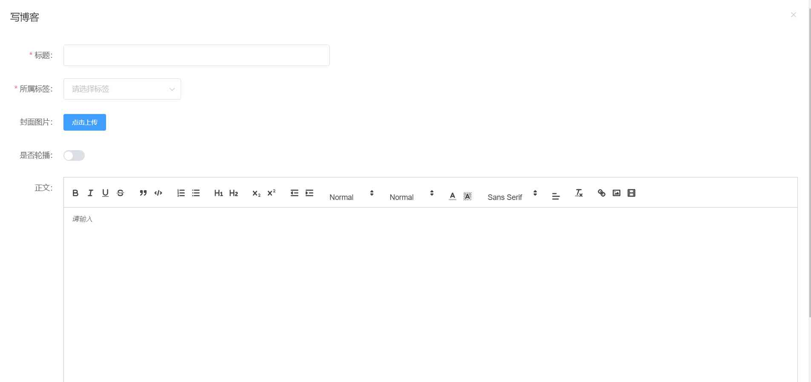

# 星空个人博客系统 

##（源代码+12000字文档+ppt）

## 项目简介

星空是一套美观大方的个人博客系统，分为展示端和管理端。 
展示端主要是对游客进行博客展示留言等操作，管理端主要是管理员对博客等信息进行管理用的。 
本系统采用的是前后端分离的方式，前端是用Vue+Elementui开发，后端是用SpirngBoot+MyBatis开发。 
数据库用的是mysql。 
总体来说涉及的技术比较广，难度适中，都是市面上主流的技术，非常适合作为设计项目或开发学习。 
视频介绍：<a href="https://www.bilibili.com/video/BV1714y1U7TF/?spm_id_from=333.999.0.0&vd_source=e6eb98771fefe4bc68298183ff572b90" target="_blank">点击查看B站视频介绍</a>

## 功能介绍
 

## 技术学习

如果你在安装过程中，或对项目有疑问，可以关注本人公众号获取本人联系方式进行咨询。 
公众号内还有更多项目供你选择。 

## 技术服务

## 技术栈

| 工具及技术             | 版本    |
| ---------------------- | ------- |
| idea                   |         |
| JDK                    | 1.8     |
| SpringBoot             | 2.2.1   |
| MyBatis                | 1.3.2   |
| JWT                    | 3.4     |
| Vue                    | 2.0     |
| ElementUI              | 2.0     |
| MySQL                  | 5.7     |
| Node                   | v16.16.0|

## 安装教程

1.代码分为两部分，blog-vue是前端代码，blog-java是后端代码。 
2.安装开发环境jdk、node.js、vscode、idea/eclipse、MySQL5.7。 
3.在mysql中创建数据库blog，导入后台代码中的blog.sql。 
4.启动前端程序和后端程序即可，后端程序默认启动端口是10000，前端调用后台默认也是调用10000端口，可自行修改。 
5.访问http://localhost:8080             是展示端首页 
6.访问http://localhost:8080/#/login     是管理端登录页面 

## 系统图片

#### 1.博客首页
 
#### 2.博客内容页
 
 
#### 3.留言板
 
#### 4.搜索博客
 
#### 5.管理端登录页
 
#### 6.统计分析
 
#### 7.写博客
 

